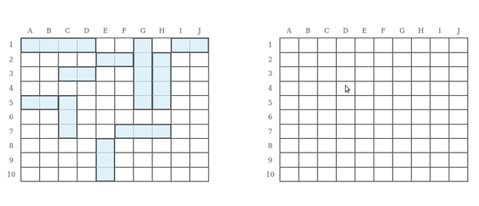

# Battleship
This is a straightforward implementation of the battleship game for the browser. A live preview of the project can be seen [here](libmartinito.github.io/battleship).

## Preview


## Motivation
The goal for this project is to learn how to test vanilla javascript using jest. This also serves as practice for setting up  and working with both webpack and vanilla javascript.

## Tech Used
- [Jest](https://jestjs.io/)
- [Webpack](https://webpack.js.org/)

## Installation
If you want to have a local copy of the project, you can do the following below. However, you need to have [git](https://github.com/git-guides/install-git), [node.js](https://www.freecodecamp.org/news/how-to-install-node-js-on-ubuntu-and-update-npm-to-the-latest-version/), and [npm](https://docs.npmjs.com/downloading-and-installing-node-js-and-npm) installed.
- Open up a terminal
- Clone the repository by typing this in the terminal:
```
git clone git@github.com:libmartinito/shopping-cart.git
```
- Install project dependencies by typing this in the terminal:
```
npm install
```

## Credits
The project is part of the full-stack javascript track at the [odin project](https://www.theodinproject.com/paths/full-stack-javascript/courses/javascript/lessons/battleship). 
